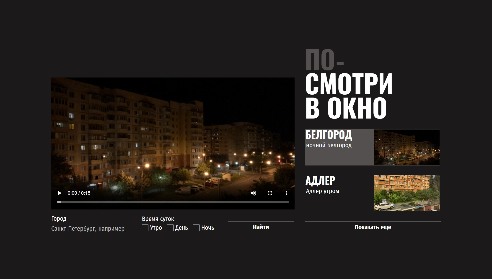

# *Посмотри в окно*

**Посмотри в окно** — Проект позволяет смотреть на разные города в разные время суток.

[Демо-страница](https://sanyazola.github.io/posmotri_v_okno/)

## Описание

Проект выполнен только на HTML и CSS. Полностью адаптивен. Включает отдельную страницу на английском языке.

### 🚀 Возможности:
- Выбрать город, время суток.
- Поставить фильтр по времени суток.

### Технологии и стек
- Flexbox.
- Структуры БЭМ классов.
- Кликабельны ссылки, кнопки, список;
- Реализована возможность visually-hidden;
- Добавлены кастомные элементы форм.
- Реализовано позиционирование прелоадеров.
- Используются псевдоклассы :active, :focus, :hover.

